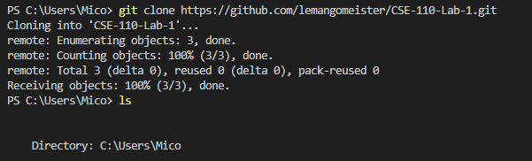
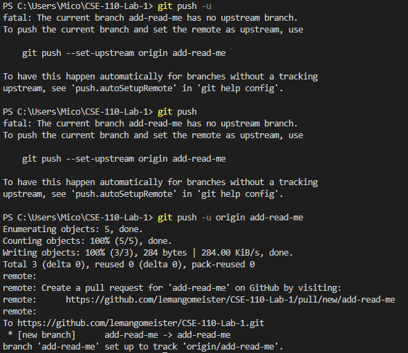

# Introduction
## Who I Am As A Person
My name is Mico Guinto. As of the time I created this User Page, I am a 4th year (Transfer Student) Computer Engineering Major under Muir College at University of California, San Diego. If I had to explain myself in three words, it would be: Introverted but Social. Some of my hobbies include:
<ol>
    <li>Enjoying intense competitive video games with friends</li>
    <li>Practicing Martial Arts</li>
    <li>And essentially anything that involves me using my legs</li>
</ol>

Some of the things I'd like to be able to do to improve myself are:
<ul>
    <li>Maintain a healthy body</li>
    <li>Improve culinary skills</li>
    <li>Improve social skills</li>
</ul>

## Who I am As A Programmmer
I am aspiring to be an effective engineer not just in the software realm, but I also aspire to be involved with hardware as well. The courses I have taken relating to hardware have been interesting to the point that I am intrigued enough to explore more of the world of hardware.
# Lab 1
## Part 2: (Re)Famialiarizing with Git 
**Command Line**
> Take a screenshot of these commands being performed as a deliverable 

